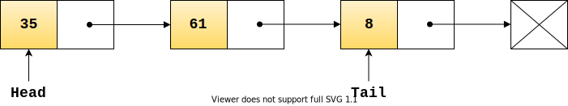
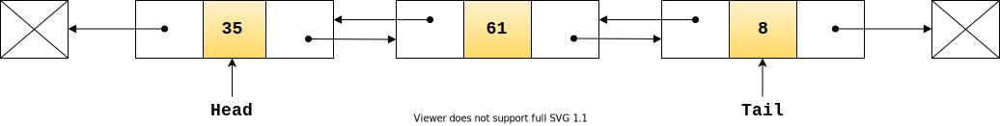

# Linked lists
A [Linked list](https://en.wikipedia.org/wiki/Linked_list) is a linear collection of data elements. 

Linked lists differ from arrays in that they can utilise non-contiguous blocks of memory, with each data element ('node') pointing to the next in the list. 

With a __Singly linked list__ each node points to the next node in the list, providing forwards-only access to nodes:

With a __Doubly linked list__ each node points to the previous and next node in the list:

## Characteristics
### Complexity
🔔 Complexity is considered in terms of worst case.

#### Time complexity
| |Insertion |Removal |Retrieval |Notes
|- |- |- |- |-
|Singly linked list |Θ(1) |Θ(n) |Θ(n) |
|Doubly linked list |Θ(1) |Θ(1) |Θ(n) |

#### Space complexity
TODO

#### Why is a doubly linked list Θ(1) on removals?
A doubly linked list does not have to be traversed to find the previous node as the node being removed includes a reference to it.