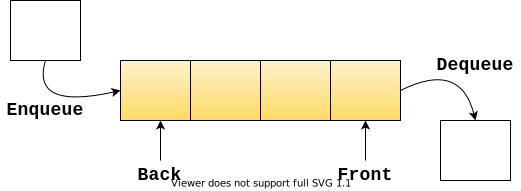

# Queues
A [Queue](https://en.wikipedia.org/wiki/Queue_(abstract_data_type)) is a linear data structure  (i.e. its elements form a sequence) and can be modified by the addition of elements at one end of the sequence and removal from the other end.

A queue is a FIFO (first in, first out) data structure.

## Characteristics
### Time complexity
|Insertion |Removal |Retrieval |Notes
|- |- |- |-
|Θ(1) |Θ(1) |Θ(n) |

### Space complexity
| |Notes
|- |-
|Θ(n) |The elements in the queue