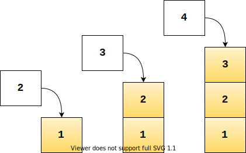
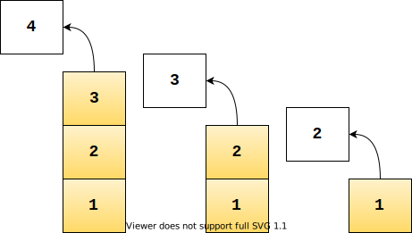

# Stacks
A [Stack](https://en.wikipedia.org/wiki/Stack_(abstract_data_type)) is  a linear data structure (i.e. its elements form a sequence) where operations are performed at the 'top' of the stack. The order may be FIFO (first in, first out) or LIFO (last in, first out).

The LIFO implementation here uses an array.

## Characteristics
### Complexity
🔔 Complexity is considered in terms of worst case.

#### Time complexity
|Insertion |Removal |Retrieval |Notes
|- |- |- |-
|Θ(1) |Θ(1) |Θ(1) |Retrieval Θ(1) if popping, otherwise Θ(n) to locate

#### Space complexity
| |Notes
|- |-
|Θ(n) |The elements in the stack